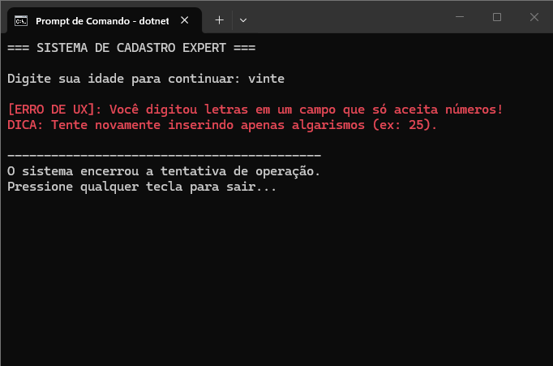

# ⚡ Explique o que é o try-catch e como ele se conecta com a Prevenção de Erros.
O try-catch é usado para tratar erros em um programa, evitando que ele pare de funcionar. Ele não previne erros, mas ajuda a controlar suas consequências, complementando a prevenção de erros.

## 📸 Evidência de Execução
 
(./evidencia-sucesso.png)
